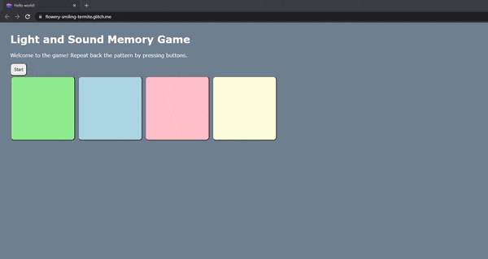

# Pre-work - *Memory Game*

**Memory Game** is a Light & Sound Memory game to apply for CodePath's SITE Program. 

Submitted by: **William Mejia**

Time spent: **3** hours spent in total

Link to project: https://glitch.com/~flowery-smiling-termite

## Required Functionality

The following **required** functionality is complete:

* [X] Game interface has a heading (h1 tag), a line of body text (p tag), and four buttons that match the demo app
* [X] "Start" button toggles between "Start" and "Stop" when clicked. 
* [X] Game buttons each light up and play a sound when clicked. 
* [X] Computer plays back sequence of clues including sound and visual cue for each button
* [X] Play progresses to the next turn (the user gets the next step in the pattern) after a correct guess. 
* [X] User wins the game after guessing a complete pattern
* [X] User loses the game after an incorrect guess

The following **optional** features are implemented:

* [ ] Any HTML page elements (including game buttons) has been styled differently than in the tutorial
* [ ] Buttons use a pitch (frequency) other than the ones in the tutorial
* [ ] More than 4 functional game buttons
* [ ] Playback speeds up on each turn
* [ ] Computer picks a different pattern each time the game is played
* [ ] Player only loses after 3 mistakes (instead of on the first mistake)
* [ ] Game button appearance change goes beyond color (e.g. add an image)
* [ ] Game button sound is more complex than a single tone (e.g. an audio file, a chord, a sequence of multiple tones)
* [ ] User has a limited amount of time to enter their guess on each turn

The following **additional** features are implemented:

- [ ] List anything else that you can get done to improve the app!

## Video Walkthrough (GIF)

If you recorded multiple GIFs for all the implemented features, you can add them here:

## Reflection Questions
1. If you used any outside resources to help complete your submission (websites, books, people, etc) list them here. 

[None]

2. What was a challenge you encountered in creating this submission (be specific)? How did you overcome it? (recommended 200 - 400 words) 

[My initial challenge had to do with time constraints. From a glance, I had thought completing the project would take longer than expected, but as I walked through the project it did not end up being so bad. Alongside there being images of what your code should currently look like, the dropdown references that give small pieces of information really helped clarify when I was unsure of why one would use such a thing over something else, for instance, using id instead of classes inside a HTML tag. With the small pieces of information, the amount of Googling I did was reduced. The last challenge I experienced was recording the gifs, my laptop did not naturally allow for screen recording alongside recording the internal audio of the laptop. To record the audio of whatever was playing on the laptop, would require me to go download a certain app and configure it to allow for recording to natively record internal audio. I decided to switch to my PC which runs on Windows and use OBS in order to capture my screen and audio. Since I already had OBS set up, all I had to do was record the gifs and upload them to my repo.]

3. What questions about web development do you have after completing your submission? (recommended 100 - 300 words) 

[Is there a learning curve for learning tech stacks? At a first glance, it seems daunting to begin learning all these technologies. I’ve read that by the time you fully master a tech stack, it would have become obsolete. It seems interesting in comparison to learning a programming language like Python or C++. Companies doing progressive refactoring seems to be a thing, would it be worth it for someone new to web development to learn the latest tech stack or is it a specific situation. Such as learning a popular tech stack and then depending on what the company you are hired for uses, possibly forgot about the tech stack you learned and instead focus on learning the companies’ stack.]

4. If you had a few more hours to work on this project, what would you spend them doing (for example: refactoring certain functions, adding additional features, etc). Be specific. (recommended 100 - 300 words) 

[If I had a few more hours to work on the project, I would work on first implementing the optional features, specifically more than four game buttons and speeding the game up. Afterwards, attempt to implement the remaining optional features. If I were to get down the optional features, I’d work on cleaning up my code, refactoring any functions that could be written more cleanly, and researching more on possible methods to use to simplify code. Additional features that are beyond the optional features would come last.]

## Interview Recording URL Link

[My 5-minute Interview Recording](your-link-here)

## License

    Copyright [William Mejia]

    Licensed under the Apache License, Version 2.0 (the "License");
    you may not use this file except in compliance with the License.
    You may obtain a copy of the License at

        http://www.apache.org/licenses/LICENSE-2.0

    Unless required by applicable law or agreed to in writing, software
    distributed under the License is distributed on an "AS IS" BASIS,
    WITHOUT WARRANTIES OR CONDITIONS OF ANY KIND, either express or implied.
    See the License for the specific language governing permissions and
    limitations under the License.
